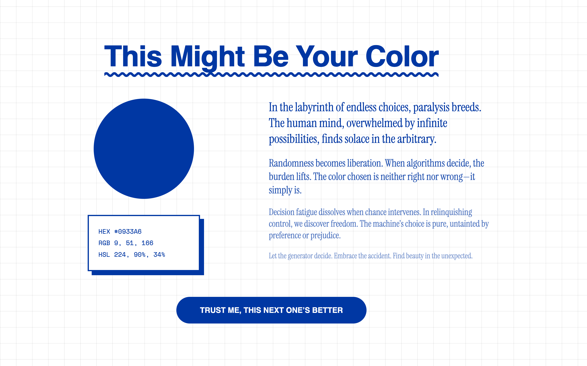

# Random Color API & Frontend

This is a full-stack project developed for the **Advanced Web Development** course at **Spiced Academy (AWD25)**. It consists of a simple Node.js/Express API that generates random colors and a minimalist vanilla JavaScript frontend that consumes the API to create a dynamic and interactive user experience.

# Features

- **Random Color Generation:** A backend API endpoint that provides a new random color on every request.
- **Multiple Formats:** The API returns the color in HEX, RGB, and HSL formats.
- **Dynamic UI:** The entire page theme (text, buttons, borders, shadows) changes based on the generated color.
- **Copy to Clipboard:** A simple click on the color values box copies all formats to the user's clipboard.
- **Interactive Feedback:** A toast notification confirms that the color codes have been copied.
- **Engaging UX:** The call-to-action button cycles through a fun array of different labels on each click.

# Tech Stack

### Backend

- [**Node.js**](https://www.google.com/url?sa=E&q=https%3A%2F%2Fnodejs.org%2F)
- [**Express.js**](https://www.google.com/url?sa=E&q=https%3A%2F%2Fexpressjs.com%2F)
- [**TypeScript**](https://www.google.com/url?sa=E&q=https%3A%2F%2Fwww.typescriptlang.org%2F)
- [**color-convert**](https://www.google.com/url?sa=E&q=https%3A%2F%2Fwww.npmjs.com%2Fpackage%2Fcolor-convert): For robust color format conversions.
- [**CORS**](https://www.google.com/url?sa=E&q=https%3A%2F%2Fwww.npmjs.com%2Fpackage%2Fcors): For enabling cross-origin requests.

### Frontend

- Vanilla HTML5
- Vanilla CSS3 (with CSS Custom Properties for theming)
- Vanilla JavaScript (ES6+)

### Development

- [**Nodemon**](https://www.google.com/url?sa=E&q=https%3A%2F%2Fwww.npmjs.com%2Fpackage%2Fnodemon): For live-reloading the server during development.
- [**ts-node**](https://www.google.com/url?sa=E&q=https%3A%2F%2Fwww.npmjs.com%2Fpackage%2Fts-node): To execute TypeScript files directly.
